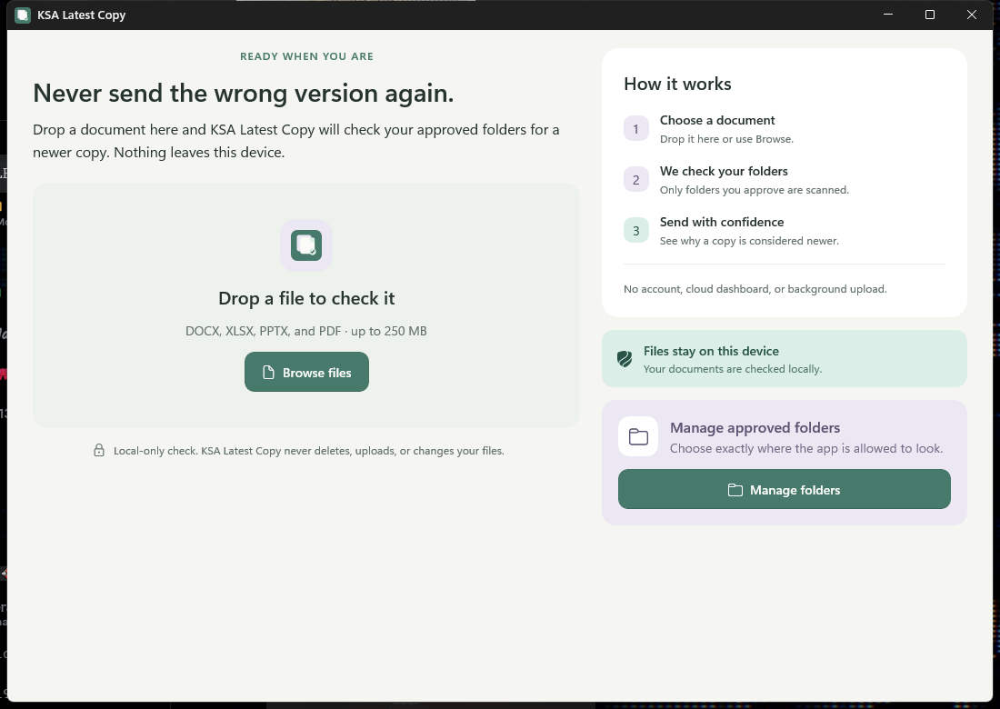
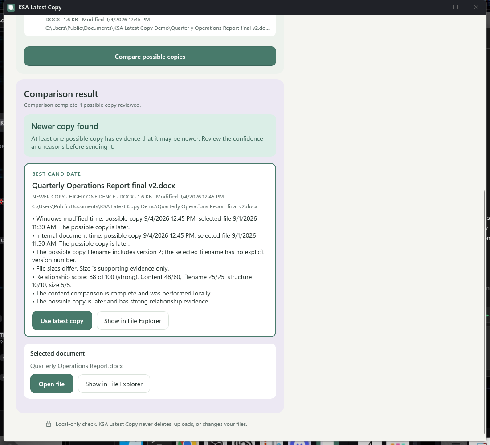
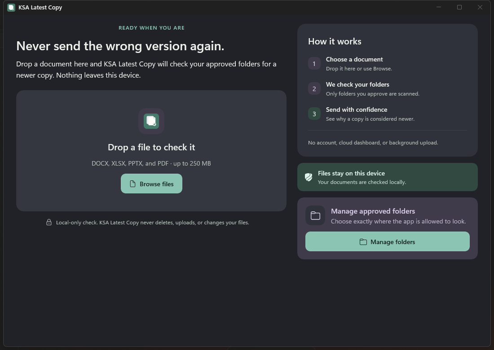

  

<h1 align="center">KSA Latest Copy</h1>

  A privacy-focused Windows utility that checks approved folders for newer versions of Office documents and PDFs.

  <strong>Windows MVP complete. Microsoft Store release preparation is in progress.</strong>

## The problem it solves

Office folders often contain files named `Report Final.docx`, `Report Final 2.docx`, and `Report Final New.docx`. Dates, filenames, and file sizes alone can make it difficult to know which document should be sent.

KSA Latest Copy checks a selected document against folders approved by the user. It finds related files, compares local evidence, and explains whether a newer copy may exist. When the evidence is incomplete or conflicting, the application says so clearly instead of guessing.

## How it works

1. Approve the folders the application may check.
2. Select or drop a DOCX, XLSX, PPTX, or PDF document.
3. Review related copies and the evidence used for comparison.
4. Open the recommended file or locate any result in File Explorer.

The application never replaces, renames, moves, or deletes documents.

## Comparison results

The comparison workflow combines local document content, structure, filename similarity, file size, and modification information. Results include a written status and supporting evidence, so meaning never depends on color alone.

## Privacy by design

- No account is required.
- Documents are not uploaded.
- Only folders selected by the user are checked.
- No advertising or usage analytics are included.
- No background scanning takes place.
- Online-only cloud files are not downloaded without user action.

## Light and dark appearance

KSA Latest Copy follows the Windows appearance by default and also supports an explicit light or dark preference.

## Technology

KSA Latest Copy is built for Windows 11 using C#, .NET 10, WinUI 3, and MSIX packaging. Document analysis runs locally with bounded extraction and deterministic comparison rules.

## Availability

The application is planned as a free Microsoft Store download. The source code is private and proprietary, so this repository contains only reviewed product information and presentation material.

## Project information

- **Author:** [KSAGlory](https://github.com/KSAGlory)
- **Community:** [discord.gg/ksahub](https://discord.gg/ksahub)

Copyright © 2026 KSAGlory. All rights reserved. No permission is granted to copy, modify, or redistribute the branding or presentation assets in this repository.
