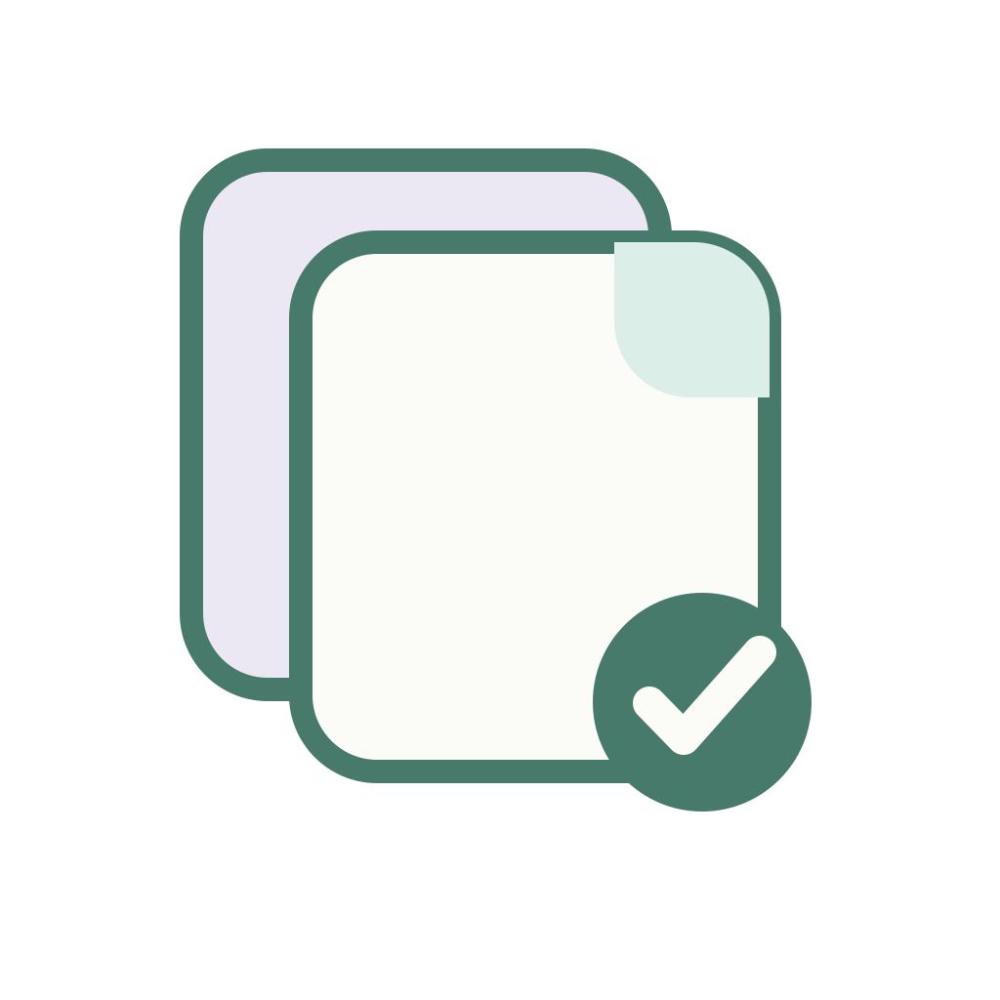
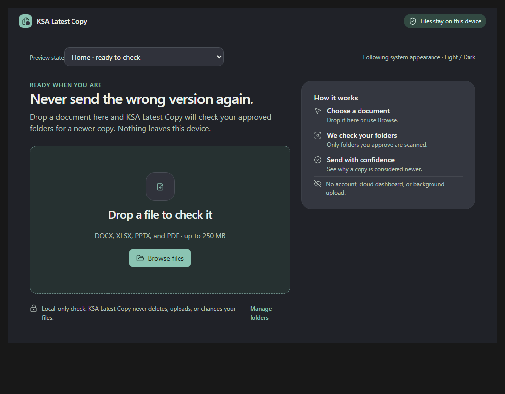

  

<h1 align="center">KSA Latest Copy</h1>

  <strong>Never send the wrong version again.</strong> 
  A calm, local-first Windows utility for finding newer copies of Office documents and PDFs.

> **Project status:** In development. This public repository is the official product showcase; the application source is private and proprietary.

## The everyday problem

Files named `Report Final.docx`, `Report Final 2.docx`, and `Report Final REALLY FINAL.docx` are a familiar office problem. KSA Latest Copy is designed to check a selected document against folders the user approves, identify likely newer related copies, and explain the evidence before the user sends the wrong file.

## What makes it useful

- Checks DOCX, XLSX, PPTX, and PDF documents.
- Compares filenames, modification times, document structure, and local content similarity.
- Shows the exact paths and reasons behind every recommendation.
- Handles uncertain or incomplete scans honestly instead of giving false reassurance.
- Never deletes, renames, moves, or replaces a document.

## Private by design

- Files remain on the user's Windows device.
- Only folders explicitly approved by the user are scanned.
- No account, upload, cloud dashboard, advertising, or telemetry.
- No background indexing in the first release.
- Cloud-only placeholder files are not silently downloaded for comparison.

## Planned experience

1. Choose the folders KSA Latest Copy may check.
2. Drop a document into the app or select it with Browse.
3. Review a clear local result: no newer related copy found, newer copy found, several possible versions, or incomplete scan.
4. Open the recommended file or reveal it in File Explorer. The app never replaces anything automatically.

## Windows-first engineering

The planned desktop application uses C# and .NET 10 LTS with WinUI 3 and MSIX packaging. Office formats are read structurally through Open XML; PDFs are compared through local text extraction. The matching system is deterministic and explainable—no document content is sent to an AI service.

## Roadmap

- [x] Product research and positioning
- [x] Light and dark visual system
- [x] Approved application logo
- [x] Technical and privacy architecture
- [ ] Windows application foundation
- [ ] Local comparison engine and test corpus
- [ ] Accessible production interface
- [ ] Microsoft Store release candidate
- [ ] Microsoft Store publication

## Repository and rights

This repository intentionally contains product information and approved preview material, not application source code. KSA Latest Copy is a closed-source proprietary product. No open-source license is granted, and no permission is given to copy, modify, redistribute, or create derivative works from the product branding or materials in this repository.
